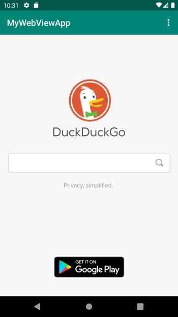
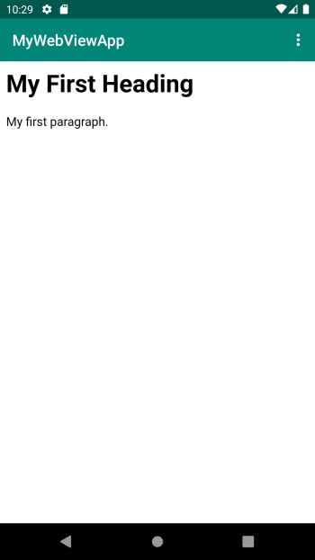

# Rapport
- Uppgiften bestod i att visa en extern och en intern hemsida internt i en app. För att åstadkomma detta behövdes ett antal åtgärder vidtas. Nedan följer en beskrivning av de åtgärder som behövde vidtas för att uppfylla uppgiftens krav. 

- Jag ändrade taggen app_name i strings.xml till MyWebViewApp.
- För att appen skulle få tillstånd att komma åt internet lade jag i AndroidManifest.xml till taggen 
```
<uses-permission android:name="android.permission.INTERNET" />
```

- För att appen skulle kunna visa websidor så behövde en TextView ändras till en WebView vilket gjordes i activity_main.xml, det krävdes även att den omgivande layouten ändrades från en constraintlayout till en RelativeLayout. Utan ändringen så visades ingenting i den skapade webbvyn. I WebView-taggen så definerade jag attributet android:id="@+id/my_webview", detta för att jag senare skulle kunna instantiera vyn med hjälp av detta id. Jag ändrade även layout-attributen i WebView-taggen till match_parent.
```
	<WebView
        android:id="@+id/my_webview"
        android:layout_width="match_parent"
        android:layout_height="match_parent"
        />
```
- I klassen MainActivity så skapades variablerna webview och webSettings. Den förra krävdes för att kunna lagra en instans av webbvyn vars definition nämndes ovan. Den senare användes för lagra ett medlemsobjekt i WebView-klassen av typen WebSettings som används för manipulera inställningar i instanser av WebView-klassen. 

```
public class MainActivity extends AppCompatActivity {

    private WebView webview;
    private WebSettings webSettings;
```

Webbvyn instantierade sedan med ett anrop till findViewById(R.id.my_webview), där det id som vyn försetts med användes som argument. Vyn kopplades sedan samman med en instans av en WebViewClient, detta för att en hemsida skulle kunna ses direkt i appen istället för att öppnas i en extern webbläsare. 

```
	webview = (WebView) findViewById(R.id.my_webview); //instantiate webview
	webview.setWebViewClient(new WebViewClient()); // connect webview to webviewclient
```
- För att aktivera javascript anropades setJavaScriptEnabled(true) på det medlemsobjekt i WebView-klassen som tidigare nämndes. Tillgång till detta erhölls via ett anrop till getSettings(). 
```
	webSettings = webview.getSettings();
	webSettings.setJavaScriptEnabled(true);
``` 
- För att man skulle kunna gå tillbaka till tidigare sidor med hjälp av androids bakåtknapp  ändrades definitionen av onBackPressed() så att kontroll utfördes huruvuda det gick att backa medelst metoden canGoBack(), om så gick så backades med metoden goBack(), annars avslutades appen.  
  
```
@Override
    public void onBackPressed(){
        if(webview.canGoBack()){ //check if you can go back
            webview.goBack(); // go back
        } else {
            super.onBackPressed(); //else exit the app
        }
    }
```
  
- I metoden onOptionsItemSelected(MenuItem item) så registrerades showExternalWebPage() som händelsehanterare för klick på menyvalet "External Web Page". Metoden var till en början tom och och var tvungen att implementeras vilket gjordes relativt enkelt genom att göra ett anrop till medlemsmetoden loadUrl() med önskad url som argument.

```
public void showExternalWebPage(){
        // TODO: Add your code for showing external web page here
        webview.loadUrl("https://www.duckduckgo.com");
    }
```


- För menyvalet "Internal Web Page" var dock ingen händelsehanterare registrerad. Det gjordes genom att i onOptionsItemSelected(MenuItem item) anropa showInternalWebpage() om det menyval som hade gjorts hade id action_internal_web
```
	if (id == R.id.action_internal_web) {
	            Log.d("==>","Will display internal web page");
	            showInternalWebPage();
	            return true;
	}
```

- För att få showInternalWebPage() att visa den lokala html-sidan local.html gjordes ett anrop till loadUrl() med en url med det särskilda formatet file:///android_asset/local.html där file:///android_asset/ reprsenterar en asset-katalog som tidigare skapats. För att detta skulle fungera var behövde appen först tillstånd att läsa lokala filer, vilket den gavs med anrop till setAllowFileAccess(true) och setAllowContentAccess(true). 

```
 	webSettings.setAllowFileAccess(true);
 	webSettings.setAllowContentAccess(true);
 	webview.loadUrl("file:///android_asset/local.html");
```



